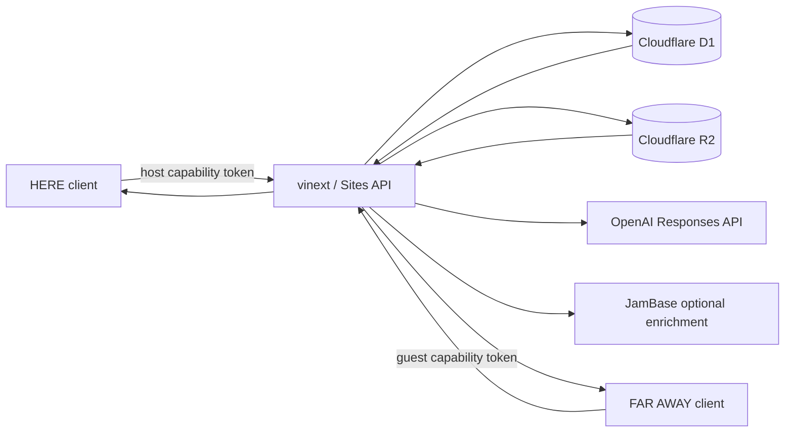

# Same Sky — Cursor Handoff

Last updated: 2026-08-02 (America/Los_Angeles)

## Mission

Win OutsideLLMS III in **Make the festival better**, with a secondary **Superfan connection** angle.

Same Sky is a private synchronous ritual between one person at Outside Lands and one person watching elsewhere. The onsite person captures a rights-safe image plus literal sensory details. OpenAI converts only those facts into a structured sensory postcard. The sender reviews it before publishing. The remote person holds once to send a pulse back. Both screens become the same light for eight seconds.

Core positioning: **Livestreams transmit video. Same Sky transmits presence.**

## Important URLs

- Production: https://same-sky-live.vnmoorthy.chatgpt.site
- GitHub: https://github.com/vnmoorthy/same-sky
- Hackathon: https://outsidellms.com/
- Event page: https://luma.com/OutsideLLMS3

## Current State

- Full-stack product is implemented and functional.
- Production D1 and R2 are healthy.
- Production lifecycle was verified end to end:
  `waiting → connected → draft_ready → postcard_ready → pulse_ready → deleted`.
- The one-screen judge demo uses two real API clients.
- `npm test` passes.
- `npm run build` passes.
- `npm run lint` passes with non-blocking image/hook warnings.
- The 10-slide deck passes the no-overflow verifier.
- A major V2 visual redesign is currently in the working tree:
  - cinematic generated festival hero image;
  - asymmetric editorial landing page;
  - acid-chartreuse signal accent;
  - sharper, less card-heavy UI;
  - completely rebuilt 10-slide cinematic deck.
- At the time this file was first written, the V2 visual changes had not yet been committed, pushed, or redeployed. Check `git status`, then follow **Immediate Release Steps** below.

## Product Experience

### Landing

- Choose **I’m at the festival** to create a private bridge.
- Choose **I’m watching from home** to join with a six-character code.
- Choose **Judges: feel the full ritual in 30 seconds** for the fastest judged demo.
- Privacy modal explains identity, recording, AI, review, deletion, and expiry boundaries.

### Host / HERE

1. Create bridge and share six-character code.
2. Select artist and stage.
3. Capture or use the face-free sample image.
4. Add literal sensory facts, energy, optional four-second on-device intensity estimate.
5. Generate postcard.
6. Review all generated language.
7. Publish once.
8. Hold the phone while the guest pulse arrives.

### Guest / FAR AWAY

1. Join the bridge once.
2. Receive the approved postcard through polling.
3. Select a pulse color.
4. Press and hold, or use the Enter-key alternative.
5. Both clients run the synchronized eight-second light ritual.

## Architecture



State machine:

```text
waiting → connected → draft_ready → postcard_ready → pulse_ready → completed
```

Further detail: `docs/ARCHITECTURE.md`.

## Key Files

- `app/same-sky-app.tsx` — all client states and interactions.
- `app/globals.css` — complete responsive design system and V2 visual layer.
- `app/api/sessions/**` — session lifecycle APIs.
- `app/api/artists/route.ts` — JamBase-ready artist enrichment.
- `app/api/health/route.ts` — runtime readiness.
- `lib/server/db.ts` — D1 setup and expiry cleanup.
- `lib/server/session.ts` — codes, tokens, auth, serialization.
- `lib/server/postcard.ts` — OpenAI structured generation and honest fallback.
- `lib/types.ts` — shared session/postcard types.
- `.openai/hosting.json` — Sites project and binding declarations.
- `public/hero-festival-v2.png` — custom V2 cinematic hero artwork.
- `docs/Same-Sky-Hackathon-Deck.pptx` — final 10-slide deck.
- `docs/PITCH.md` — three-minute talk track.
- `docs/SUBMISSION.md` — submission copy and 90-second runbook.
- `docs/ARCHITECTURE.md` — architecture and trust boundaries.
- `README.md` — repository landing page.

## API Surface

| Method | Route | Purpose |
|---|---|---|
| POST | `/api/sessions` | Create bridge and host token. |
| POST | `/api/sessions/join` | Claim bridge and guest token. |
| GET | `/api/sessions/:code` | Poll authenticated state. |
| POST | `/api/sessions/:code/presence` | Validate inputs, store media, generate draft. |
| POST | `/api/sessions/:code/publish` | Host approval gate. |
| POST | `/api/sessions/:code/pulse` | Guest-only synchronized pulse scheduling. |
| GET | `/api/sessions/:code/photo` | Authenticated private media fetch. |
| DELETE | `/api/sessions/:code/delete` | Immediate participant deletion. |
| GET | `/api/artists` | JamBase or bundled artist lookup. |
| GET | `/api/sky` | Anonymous aggregate pulse field. |
| GET | `/api/health` | D1, R2, OpenAI, JamBase readiness. |

## Environment and Secrets

Optional local `.dev.vars`:

```dotenv
OPENAI_API_KEY=...
OPENAI_MODEL=gpt-5.6-terra
JAMBASE_API_KEY=...
```

Bindings in `.openai/hosting.json`:

```json
{
  "d1": "DB",
  "r2": "MEDIA"
}
```

Current production state when last verified:

- D1: configured and healthy.
- R2: configured and healthy.
- OpenAI secret: not configured; app uses the explicit `festival-safe` fallback.
- JamBase secret: not configured; app uses the bundled artist preview.

Do not commit API keys. Configure secrets through the Sites environment-variable tool or platform UI, then redeploy a saved version.

## Local Commands

```bash
npm install
npm run dev
npm run build
npm test
npm run lint
```

The vinext dev server may choose another port if 3000 is occupied. Use the printed URL.

## Immediate Release Steps

1. Inspect the current V2 changes:

   ```bash
   git status --short
   git diff -- app/same-sky-app.tsx app/globals.css
   ```

2. Re-run quality gates:

   ```bash
   npm test
   npm run lint
   ```

3. Verify the deck:

   ```bash
   /Users/moorthy/.cache/codex-runtimes/codex-primary-runtime/dependencies/python/bin/python3 \
     /Users/moorthy/.codex/plugins/cache/openai-primary-runtime/presentations/26.802.11031/skills/presentations/container_tools/slides_test.py \
     docs/Same-Sky-Hackathon-Deck.pptx
   ```

4. Commit and push:

   ```bash
   git add app/same-sky-app.tsx app/globals.css public/hero-festival-v2.png \
     docs/Same-Sky-Hackathon-Deck.pptx docs/same-sky-hero.png HANDOFF.md
   git commit -m "Elevate Same Sky with cinematic festival art direction"
   git push origin main
   ```

5. Save and deploy the new Sites version using project ID:

   ```text
   appgprj_6a6fde2966cc8191b1eb4fd89ee55783
   ```

   The previously successful deployment was:

   ```text
   version: appgprj_6a6fde2966cc8191b1eb4fd89ee55783~appgver_26695949657c8191a2933304300d6865
   deployment: appgdep_6a6fdeaf950c819197f0fd3475104e3e
   ```

   Create a new version for the new commit; do not reuse the previous version ID.

6. Verify:

   ```bash
   curl -sS https://same-sky-live.vnmoorthy.chatgpt.site/api/health
   ```

## Demo Script

Fast judged sequence:

1. Open production.
2. Click the one-screen judge demo.
3. Say: “Livestreams transmit video. Same Sky transmits presence.”
4. Create the field postcard.
5. Publish it.
6. Ask a judge to hold the remote pulse.
7. Stop talking for the full eight seconds.
8. Close with: “Outside Lands already brings the show everywhere. Same Sky brings one person into the feeling of being there.”

## Trust Boundaries

- No accounts, names, email, GPS, contacts, or public lookup.
- The six-character code locates a bridge; long random role tokens authorize it.
- Raw audio never leaves the browser and is never saved.
- Images are resized and metadata-stripped client-side, then size/type checked server-side.
- OpenAI uses minimal inputs, `store: false`, structured output, safety instructions, and a hard timeout.
- Generation never publishes automatically.
- Either participant can delete immediately.
- Bridges expire within 24 hours.
- The aggregate sky contains no identity, image, observation, postcard, or private code.

## Known Non-Blocking Items

- Production OpenAI/JamBase integrations require secrets to activate.
- ESLint may report warnings for intentional authenticated `` blob rendering and narrowly scoped polling-effect dependencies; there are no lint errors.
- Local `npm run start` may not understand the Cloudflare URL scheme outside the Sites/vinext runtime; use `npm run dev` or production.
- The legacy gstack browse runner on this machine returned blank screenshots and leaked daemon ports. Product rendering itself remained healthy; use Chrome/Playwright, the Codex browser, or Cursor browser tooling for visual QA.

## Visual Direction

Do not drift back toward generic SaaS styling.

- Mood: cinematic Golden Gate Park at blue hour.
- Palette: ink black, bone, signal coral, acid chartreuse.
- Typography: oversized editorial display type + monospaced operational labels.
- Composition: asymmetric, full-bleed, hard editorial rules.
- Avoid: purple gradient blobs, uniform rounded cards, centered feature grids, emoji decoration, generic dashboard UI.
- The hero art is original AI-generated project artwork with no logos, text, identifiable faces, or celebrity likenesses.

## Definition of Done

- V2 visual changes committed and pushed.
- Sites production redeployed from the exact commit.
- Live landing page and judge demo manually checked on desktop and mobile.
- GitHub README hero reflects the V2 deck cover.
- Deck remains exactly 10 slides and passes overflow checks.
- Production health endpoint returns `ok: true`, `database: true`, and `media: true`.
