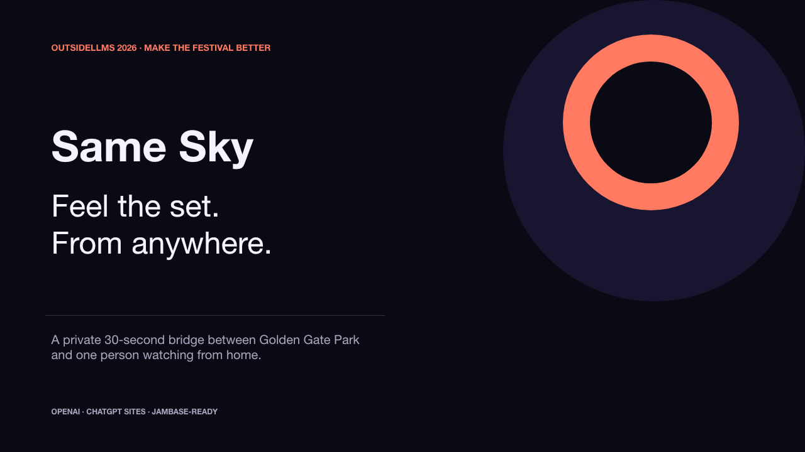

# Same Sky

> Livestreams transmit video. Same Sky transmits presence.

[](https://same-sky-live.vnmoorthy.chatgpt.site)

**[Launch the live product →](https://same-sky-live.vnmoorthy.chatgpt.site)**

Same Sky is a private, synchronous ritual between one person at a music
festival and one person watching from somewhere else. The onsite fan captures a
rights-safe image and a few literal sensory details. OpenAI turns only those
inputs into an accessible postcard, which the sender reviews before release.
The remote fan receives it and holds once to return a pulse. Both screens become
the same light for eight seconds.

No profiles. No feed. No chat. No reaction count. One person, one moment, gone
within 24 hours.

Built for **OutsideLLMS III** in the **Make the festival better** category, with
a secondary **Superfan connection** benefit.

## Judge demo

From the landing page, choose **Judges: feel the full ritual in 30 seconds**. It opens two
private clients—**HERE** and **FAR AWAY**—against the real session APIs and walks
through:

1. create and pair a private bridge;
2. turn a rights-safe capture into a reviewed sensory postcard;
3. deliver it to the remote client through polling;
4. hold to return one pulse; and
5. run the synchronized eight-second light sequence.

The bundled capture is face-free and deterministic. When an OpenAI key is
present, the demo uses the live Responses API. If it is absent or times out,
Same Sky uses an explicitly labeled, festival-safe generator so the emotional
payoff never depends on venue connectivity.

The tight judged runbook is in [docs/SUBMISSION.md](docs/SUBMISSION.md); the
full three-minute storyboard is in [docs/PITCH.md](docs/PITCH.md).

## The experience

```text
HERE                                  FAR AWAY
Create a private bridge  ───────────▶ Join with the six-character code
Choose the set + capture              Wait on the private bridge
Review every generated word ───────▶ Receive one sensory postcard
Keep the phone in hand   ◀─────────── Hold once to send a pulse
              BOTH SCREENS SHARE ONE LIGHT FOR 8 SECONDS
```

The product is deliberately small. Removing feeds, chat, and follower mechanics
turns the remote viewer from an audience metric into one specific human being.

## Sponsor stack

| Sponsor/tool | Role in Same Sky |
|---|---|
| **OpenAI Responses API** | Converts firsthand text, structured sensor values, and an optional low-detail image into schema-validated postcard copy and objective alt text. `store: false`; 5.5-second timeout; deterministic fallback. |
| **ChatGPT Sites + vinext** | Hosts the full-stack React experience and declares its D1/R2 bindings in `.openai/hosting.json`. |
| **Codex** | Used to research, design, implement, test, and demo-harden the product. |
| **JamBase** | Enriches artist search when a key is configured. A bundled festival preview keeps selection usable offline. Visible `Powered by JamBase` attribution is retained. |
| **Cloudflare D1 + R2** | D1 stores the expiring private state machine; R2 stores only the resized private image. |

See [docs/ARCHITECTURE.md](docs/ARCHITECTURE.md) for the data flow, state
machine, API contract, and trust boundaries.

## Local setup

### Requirements

- Node.js `>=22.13.0`
- npm

### Install and run

```bash
npm install
npm run dev
```

The Cloudflare Vite plugin creates local D1 and R2 bindings from
`.openai/hosting.json`. Open the local URL printed by vinext.

### Optional environment

Create an ignored `.dev.vars` file for live integrations:

```dotenv
OPENAI_API_KEY=your_openai_api_key
OPENAI_MODEL=gpt-5.6-terra
JAMBASE_API_KEY=your_jambase_api_key
```

Only `OPENAI_API_KEY` changes postcard generation from `festival-safe` to
`openai`. `OPENAI_MODEL` and `JAMBASE_API_KEY` are optional. D1 (`DB`) and R2
(`MEDIA`) are platform bindings, not string environment variables.

Check runtime readiness at:

```bash
curl http://localhost:3000/api/health
```

Use the actual port printed by the development server if it differs.

## Commands

```bash
npm run dev          # local vinext + Cloudflare development server
npm run build        # production build
npm test             # build, then verify product copy and server transitions
npm run lint         # ESLint
npm run db:generate  # generate Drizzle migrations after schema changes
```

The API also creates the minimal D1 schema defensively at runtime, while the
checked-in Drizzle migration documents the deployable schema.

## API surface

| Method | Route | Purpose |
|---|---|---|
| `POST` | `/api/sessions` | Create a 24-hour bridge and host capability token. |
| `POST` | `/api/sessions/join` | Claim a bridge once and receive the guest token. |
| `GET` | `/api/sessions/:code` | Poll private state with a host/guest bearer token. |
| `POST` | `/api/sessions/:code/presence` | Validate capture data, store optional media, and generate the draft. |
| `POST` | `/api/sessions/:code/publish` | Host approval gate: release the draft to the guest. |
| `POST` | `/api/sessions/:code/pulse` | Guest-only, idempotent scheduling of the shared eight-second pulse. |
| `GET` | `/api/sessions/:code/photo` | Token-gated, `private, no-store` image delivery. |
| `DELETE` | `/api/sessions/:code/delete` | Let either participant erase the bridge immediately. |
| `GET` | `/api/artists` | JamBase-enriched artist lookup with bundled fallback. |
| `GET` | `/api/sky` | Anonymous aggregate pulse field; no identity, postcard, or image data. |
| `GET` | `/api/health` | D1 and optional integration readiness. |

## Privacy and consent

- There are no accounts or public session lookup.
- The six-character code is only a locator; long random host/guest capability
  tokens authorize every private read and mutation.
- A guest can claim a bridge only once.
- Images accept only JPEG, PNG, or WebP and are capped at 1.6 MB server-side;
  the client resizes and strips metadata before upload.
- Ambient audio never leaves the browser. The UI takes only a short,
  uncalibrated intensity estimate and stores no recording.
- OpenAI receives the minimum postcard inputs, with `store: false`, a scoped
  safety identifier, strict JSON Schema output, and instructions against face
  identification, private-trait inference, lyrics, invented weather, or artist
  endorsement.
- The sender sees the draft before `publish`; generation is never delivery.
- Either participant can delete immediately. Every bridge becomes inaccessible
  at 24 hours; subsequent cleanup removes its D1 row and R2 media together.
- The aggregate sky exposes only a derived coordinate, artist label, pulse
  color, and timestamp—never a person, code, image, observation, or postcard.

## Testing and demo hardening

`npm test` performs a clean production build and checks that:

- the shipped page is Same Sky rather than starter content;
- both roles and the hold-to-pulse interaction are present; and
- every server transition—draft, publish, pulse, and delete—exists.

Before presenting, also run this manual smoke test:

1. open judge mode;
2. confirm two clients pair;
3. make and approve the postcard;
4. confirm it arrives without refresh;
5. hold until the pulse schedules; and
6. let the full eight seconds finish.

## Documentation

- [Architecture and trust model](docs/ARCHITECTURE.md)
- [Three-minute pitch storyboard](docs/PITCH.md)
- [Submission copy, 90-second runbook, and checklist](docs/SUBMISSION.md)

## Sources and attribution

- [OutsideLLMS official site](https://outsidellms.com/)
- [OutsideLLMS III event page](https://luma.com/OutsideLLMS3)
- [Official Outside Lands livestream on Prime Video](https://www.primevideo.com/detail/0FFYUNMY3OBBG8WGDH9O8IY7UO)
- [OpenAI Responses API](https://platform.openai.com/docs/api-reference/responses/create)
- [OpenAI Structured Outputs](https://platform.openai.com/docs/guides/structured-outputs)
- [JamBase API quickstart](https://data.jambase.com/api/docs/getting-started)
- [JamBase attribution requirements](https://data.jambase.com/api/docs/attribution)
- [vinext](https://github.com/cloudflare/vinext)
- [Cloudflare D1](https://developers.cloudflare.com/d1/) and [R2](https://developers.cloudflare.com/r2/)

Same Sky is an independent hackathon prototype. It does not claim affiliation
with or endorsement by Outside Lands, Amazon Music, Prime Video, OpenAI,
JamBase, or Cloudflare.
