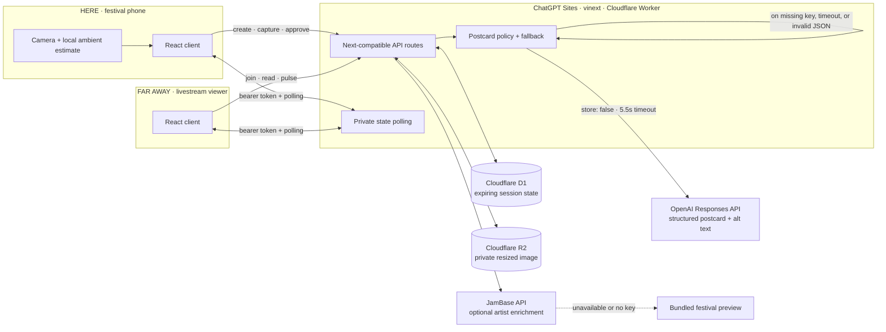
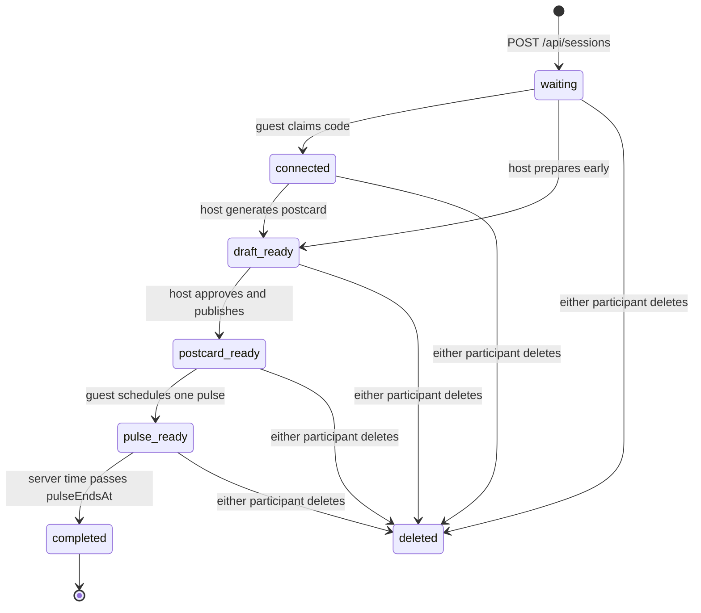

# Same Sky architecture

Same Sky is a two-client, capability-token application built around one narrow
state machine. The host at the festival creates and approves a sensory
postcard; one remote guest receives it and schedules a shared eight-second
pulse. D1 is the source of truth, R2 holds optional expiring media, and clients
poll the same server timestamps so weak venue connectivity degrades gracefully.

## System context

## Product state machine

The database stores six statuses. Pairing (`guest_token IS NOT NULL`) is also
returned separately because a host may prepare a draft before the guest joins.
`completed` is derived on read once `pulse_ends_at` passes.

All active states also become inaccessible when `expires_at <= now`; lazy purge
deletes both the D1 row and corresponding R2 object.

## End-to-end request flow

1. **Create.** `POST /api/sessions` inserts a 24-hour row, a collision-checked
   six-character code, and a long random host capability token.
2. **Join.** `POST /api/sessions/join` atomically claims `guest_token` only when
   it is null. A bridge has exactly one remote guest.
3. **Capture.** The browser resizes an optional image and measures only a short,
   uncalibrated ambient intensity. Raw audio never leaves the device.
4. **Generate.** Host-only `POST /presence` validates and bounds every input,
   stores optional image bytes in R2, and requests a strict postcard object.
5. **Review.** The host receives `draft_ready`; the guest still cannot see the
   postcard. `POST /publish` is the explicit human approval gate.
6. **Deliver.** Both clients poll private `GET /sessions/:code`; the guest sees
   the postcard only after `postcard_ready`.
7. **Return.** The guest holds the UI control. `POST /pulse` atomically stores
   `pulse_at = serverNow + 1800ms` and `pulse_ends_at = pulse_at + 8000ms`.
8. **Synchronize.** Both clients use those server-authored timestamps for the
   overlay; the host vibrates when browser support exists.
9. **Fade.** Either token may call `DELETE`; otherwise the session becomes
   inaccessible at 24 hours and lazy cleanup removes its row and image together.

## Components and ownership

| Component | Responsibility |
|---|---|
| `app/same-sky-app.tsx` | Role selection, bridge UI, capture controls, polling, hold interaction, synchronized overlay, and one-screen judge mode. |
| `app/api/sessions/**` | Capability authorization and legal state transitions. |
| `lib/server/session.ts` | Code/token generation, role resolution, serialization, and common no-store responses. |
| `lib/server/postcard.ts` | OpenAI request policy, strict response validation, timeout, sanitization, and festival-safe generator. |
| `lib/server/db.ts` | Runtime bindings, defensive schema initialization, and coordinated D1/R2 expiry purge. |
| `app/api/artists/route.ts` | JamBase lookup with bounded request and bundled preview fallback. |
| `app/api/sky/route.ts` | Privacy-reduced aggregate pulse field; never returns private content. |
| `.openai/hosting.json` | ChatGPT Sites project plus `DB` and `MEDIA` binding declarations. |

## Data model

The `sessions` row contains:

- identity and authorization: internal UUID, public code, host token, guest token;
- lifecycle: status, demo flag, created/updated/expiry timestamps;
- context: artist ID/name/link and stage name;
- firsthand inputs: bounded observation and `Senses` JSON;
- private media pointer: R2 key and MIME type;
- approved artifact: `Postcard` JSON and `ai_mode` provenance;
- synchronization: pulse color, start, and end timestamps.

No user account, email address, social profile, chat history, follower edge, raw
audio, GPS coordinate, or original-resolution image is represented in the
schema.

## API and authorization contract

| Endpoint | Role | Important invariants |
|---|---|---|
| `POST /api/sessions` | public | Creates a new host token; expiry is fixed to 24 hours. |
| `POST /api/sessions/join` | public + code | Six normalized characters; atomic one-guest claim. |
| `GET /api/sessions/:code` | host or guest token | Private, `no-store`; includes `serverNow`. |
| `POST /presence` | host | Allowed before delivery only; bounded strings, sensor ranges, and image formats. |
| `POST /publish` | host | Idempotent; requires a generated draft. |
| `POST /pulse` | guest | Idempotent; allowed only after publication; one scheduled pulse. |
| `GET /photo` | host or guest token | R2 stream with `private, no-store` and `nosniff`. |
| `DELETE /delete` | host or guest token | Deletes R2 media first, then the D1 row. |

Tokens are accepted through `Authorization: Bearer`. The bridge code locates a
row but grants no private access by itself.

## AI trust boundary

The Responses API receives:

- confirmed artist and stage context;
- bounded firsthand observation;
- sender-reported energy, tags, light, and air;
- an optional low-detail data URL for the resized image.

The request sets `store: false`, uses a session-scoped safety identifier, and
requires strict JSON Schema fields: `title`, `body`, `altText`, `signal`, and a
three-color palette. Instructions forbid identifying people, inferring private
traits or emotions, quoting lyrics, inventing weather, claiming endorsement, or
implying audio was sent.

The response is parsed, structurally validated, length-limited, and returned as
`ai_mode: openai`. Missing credentials, a non-2xx response, timeout, malformed
JSON, or invalid colors switch to a deterministic `festival-safe` postcard.
Generation never publishes: only the host’s subsequent `/publish` action makes
the postcard visible to the guest.

## Privacy and security properties

- **Data minimization:** no accounts; no raw audio; no public postcard endpoint.
- **Capability isolation:** long random role tokens authorize private state;
  codes alone cannot read it.
- **Single recipient:** D1’s conditional update prevents a second guest race.
- **Media controls:** JPEG/PNG/WebP only, 1.6 MB server cap, private R2 delivery,
  `no-store`, and MIME sniffing protection.
- **Prompt minimization:** low-detail image, bounded text, `store: false`.
- **Human approval:** draft and published states are separate.
- **Deletion:** either participant can erase immediately; automatic expiry
  removes the row and object together.
- **Safe aggregate:** `/api/sky` derives coordinates from the code but exposes
  no code, token, identity, observation, postcard, or media URL.

The prototype does not attempt end-to-end encryption. D1, R2, and OpenAI remain
trusted processors; deployment access and secrets must be managed accordingly.

## Reliability and graceful degradation

| Dependency/failure | Behavior |
|---|---|
| OpenAI missing, slow, invalid, or unavailable | Deterministic festival-safe postcard; provenance remains visible. |
| JamBase missing or unavailable | Bundled festival preview and manual selection remain usable. |
| Microphone denied | Manual descriptors; no core step is blocked. |
| Camera denied or upload rejected | Text/sensor postcard continues without media. |
| A poll drops | Next 500–1100ms interval recovers; visibility change triggers an immediate poll. |
| Haptics unsupported | Shared visual pulse remains the source of truth. |
| Duplicate publish/pulse | Idempotent replay response returns current state. |
| Weak judged connectivity | Preloaded face-free capture plus deterministic generation fallback. |

## Testing strategy

Automated `npm test` first performs the production build, then uses Node’s test
runner to assert product identity and each server transition. `npm run lint`
covers static linting.

High-value manual checks before submission:

1. two normal browser contexts cannot join the same code as separate guests;
2. code-only requests cannot read state or media;
3. postcard remains invisible until host approval;
4. pulse is guest-only and cannot be scheduled twice;
5. host and guest begin the overlay from the same stored timestamp;
6. OpenAI-off and JamBase-off paths complete the ritual;
7. delete invalidates both clients and removes the image; and
8. judge mode completes without camera or microphone permission.

## References

- [OpenAI Responses API](https://platform.openai.com/docs/api-reference/responses/create)
- [OpenAI Structured Outputs](https://platform.openai.com/docs/guides/structured-outputs)
- [JamBase API quickstart](https://data.jambase.com/api/docs/getting-started)
- [JamBase attribution requirements](https://data.jambase.com/api/docs/attribution)
- [Cloudflare D1](https://developers.cloudflare.com/d1/)
- [Cloudflare R2](https://developers.cloudflare.com/r2/)
- [vinext](https://github.com/cloudflare/vinext)
